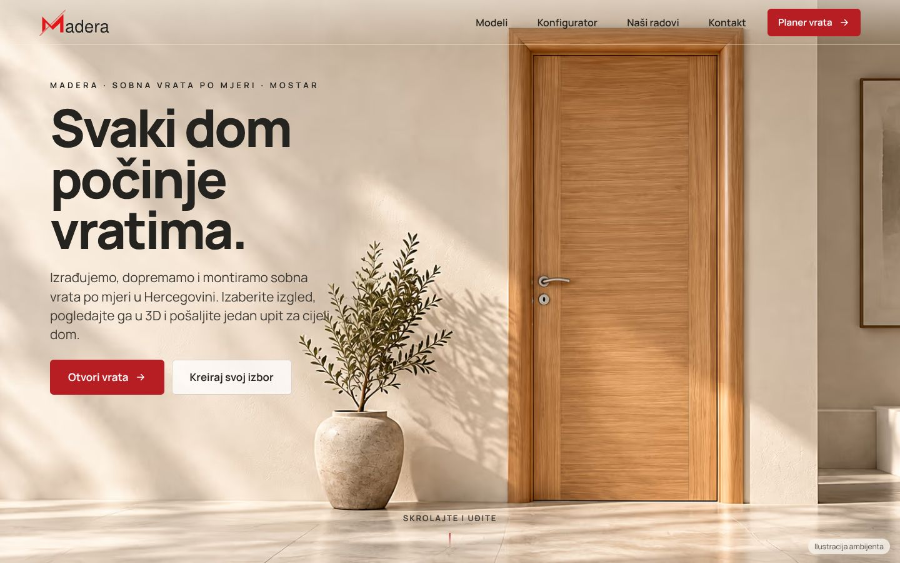
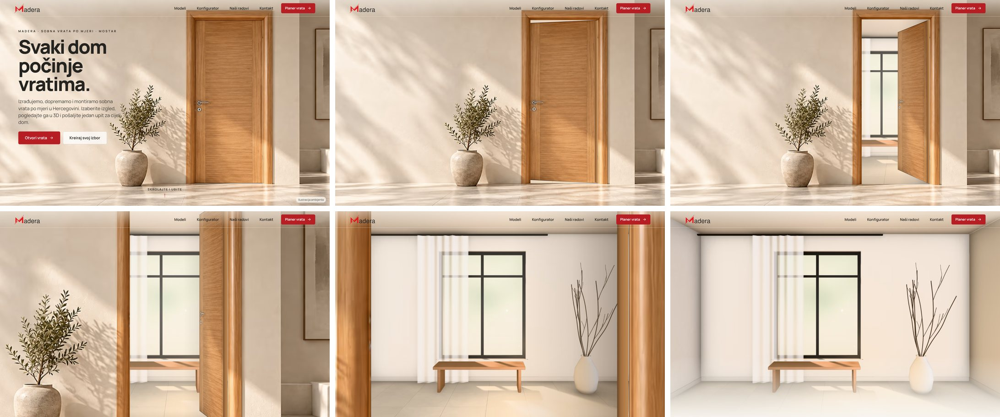

# Madera Mostar — web stranica (verzija 2)

Digitalni salon sobnih vrata za **Madera Mostar**: katalog s filterima, detalj modela, ilustrativni 3D konfigurator, kalkulator, projekt „Vrata za cijeli dom” i priprema upita.
Implementirano prema `docs/paket/CLAUDE-CODE-SUPERPROMPT.md` (verzija 2: svijetli studio, topli hrast, crveni CTA).





## Interaktivni ulaz, realističniji 3D i bolji tok (najnovije)

- **„Otvori vrata” (tehnika portala)**: početna fotografija je jedna scena s logom i menijem preko nje. Na skrol ili klik **kvaka se spusti** (ručica je zaseban sloj izrezan iz fotografije, na krilu retuširana), brava „škljocne”, krilo se otvara oko baglama u perspektivi kamere s fotografije (odsijeca se iza ravnine zida, štok pokazuje dubinu, uz baglame je sjena, topla svjetlost pada kroz otvor na pod). Iza vrata je **stvarna soba** — render istim materijalima i suncem kao 3D prikaz (kameni pod, žbuka, prozor s krošnjom, hrastova klupa), umjesto prazne podloge. Kamera se okrene prema otvoru i prođe kroz vrata; dok prolazi, krilo se otvori do kraja i nestane iza štoka (ne blijedi). Soba je zaseban oštar sloj izrezan na otvor, s paralaksom dubine i „privikavanjem oka” na svjetlo; fotografija se nikad ne uvećava do mutnoće, a pomak kamere je ograničen tako da rub fotografije nikad ne uđe u kadar (zid se iznad fotografije nastavlja zrcaljenjem, pa na telefonu nema traka). Skrol se prati s prigušenjem kao Lenis; animira se samo `transform`, `opacity` i `clip-path`; poštuje `prefers-reduced-motion` (`src/components/Entry.tsx`).
  - Soba se renderuje alatom `scripts/render-room/` (three.js + N8AO, 24 usrednjena kadra za meke sjene i antialiasing): `npx vite --port 5175`, pa `node scripts/render-room/render.mjs desktop` i `… mobile`; krilo i ručica: `python3 scripts/make-entry-assets.py`; web verzije (AVIF/WebP, 7–35 kB): `node scripts/optimize-entry.mjs`.
- **Originalni logo** (SVG iz paketa) u zaglavlju i podnožju.
- **Premium 3D rasvjeta**: kosa sunčeva svjetlost kroz prozor s krošnjom (gobo maska `public/textures/gobo-window.jpg`, `scripts/make-gobo.py`) baca sjene lišća na zid i vrata kao na početnoj fotografiji; Khronos PBR Neutral tonsko mapiranje za vjerne boje obrada (ranije je postprocesing isključivao tonsko mapiranje, pa je slika bila isprana); meka vinjeta; dnevno svjetlo i u susjednoj prostoriji. Lajsne imaju stolarski gerung pod 45° i profil s oborenim rubovima.
- **Realističniji 3D**: hrastov furnir iz Maderine originalne fotografije s normal i roughness mapama (`scripts/make-textures.py`), HDR okruženje (CC0, Poly Haven „apartment”, preko `@pmndrs/assets`), lakirane plohe s clearcoat slojem, metalne kvake s odsjajem, zaobljeni rubovi, baglame, sokl, kameni pod, meke sjene i ambijentalna sjena (N8AO).
- **Pregled**: pogledi „Ispred”, „Iz ugla”, „Detalj kvake”, „Druga strana”, zoom i prikaz preko cijelog ekrana.
- **Interaktivni konfigurator**: promjena obrade, kvake, smjera ili mjera odmah se prikazuje u 3D (iz fotografije se automatski prelazi u 3D); broj vrata − / +; brze standardne mjere (60–100 × 200–220 cm) i vlastite mjere mijenjaju proporcije 3D vrata (ilustrativno); na telefonu kompaktan 3D ostaje vidljiv dok birate opcije.
- Novi tekstovi na početnoj i u sekcijama.

## Popravke nakon audita (branch `popravka-audit`)

Prema `docs/audit/Madera-Audit.md` i `docs/audit/Madera-Claude-Code-Popravka.md`:

- **3D viewer više ne može ostati prazan.** Eksplicitna stanja `photo / loading / ready / error` (`src/three/viewerState.ts`) sa sesijom po aktivaciji i modelu; provjera **WebGL 2** (probni kontekst se oslobađa); fotografija ostaje dok renderer ne potvrdi **stvarno nacrtan kadar s vratima** (`FrameConfirm` u `DoorViewer.tsx`); obrada `webglcontextlost`, greške importa i rendera (ErrorBoundary), ograničenje od 10 s aktivnog učitavanja (ne broji se dok je tab skriven ili viewer van ekrana); ponovni pokušaj samo dugmetom; kontrole tek kad je 3D spreman; ponovno kadriranje na promjenu veličine/orijentacije; vodoravno povlačenje okreće, uspravno skrolanje stranice ostaje prirodno; niži DPR i bez mape sjena na slabijim/touch uređajima; 3D na telefonu samo na zahtjev.
- **Mobilni prvi ekran**: naslov, kratka rečenica, dugme „Kreiraj svoj izbor” i cijela vrata u jednoj sceni prema visini ekrana (`svh` uz `vh` rezervu), bez negativnih margina; posebna pravila za mali i položeni ekran.
- **Planer vrata za cijeli dom** s oznakom „Cijena na upit” (postaje „Kalkulator izrade vrata” tek uz odobren cjenovnik). Obuhvat je eksplicitan: „Ponuda za ova vrata” i „Ponuda za cijeli izbor (N vrata)”, upozorenje o nespremljenim vratima stoji prije akcije, a dijalog upita ima prekidač obuhvata.
- **Konfigurator u tri koraka** (Model i izgled → Mjere i prostorija → Pregled i ponuda), vizuelni uzorci obrade i kvake, dijagram smjera otvaranja odozgo usklađen s 3D prikazom, debljina zida u „Dodatnim opcijama”, greške uz polje i fokus na prvu grešku.
- **Katalog**: direktno „Odaberi model”, detalji sekundarni, kompaktne dvije kolone na telefonu.
- **Moj izbor** kao jedini naziv; promjena prostorije direktno u stavci (fokus nakon dupliranja).
- **Upit**: „Upit je pripremljen, još nije poslan.”, Kopiraj upit i Pozovi Maderu kao glavne akcije, TXT sekundarno, uklonjen JSON; zaštita od duplog slanja za budući endpoint.

**Preostalo za provjeru:** test na stvarnom iPhoneu/Safariju nije urađen u ovom okruženju (ovdje: Chromium sa SwiftShader WebGL-om i mobilnom emulacijom). Prije tvrdnje da je korisnikov prazan viewer riješen na iOS-u potrebno je otvoriti stranicu na telefonu. Za stvarno slanje upita nedostaje potvrđen kanal (`contactForm.endpoint` ili email u `data/site-config.json`).


## Pokretanje

```bash
npm install
npm run dev        # razvojni server (http://localhost:5173)
npm test           # Vitest: kalkulator, projekt, validacija, 3D mehanika, tok aplikacije
npm run build      # TypeScript provjera + produkcijski build u dist/
npm run preview    # pregled produkcijskog builda
npm run images     # ponovo generiše AVIF/WebP izvedenice slika (sharp)
```

Stack: React 18 + TypeScript + Vite 6, Three.js 0.169 + React Three Fiber 8 + drei 9 (kompatibilni par za React 18), Manrope (lokalno, bez Google Fonts), Vitest + Testing Library. Verzije su zaključane u `package-lock.json`.

## Šta je implementirano

- **Početna stranica** tačnim redoslijedom i tekstom iz superprompta: zaglavlje (ljepljivo, mobilni meni s Escape/fokusom), hero s posebnom mobilnom slikom (`<picture>`, AVIF/WebP), prečice „Pronađite svoj stil”, brzi kalkulator, ponuda modela, konfigurator, projekt, naši radovi, proces, česta pitanja, kontakt, footer.
- **Katalog**: 6 imenovanih modela + 5 izvedbi po želji, filteri (kategorija + potvrđene osobine), prazna poruka, „Pogledaj sve izvedbe”, detalj u pristupačnom modalu, lightbox s cijelim originalom (`object-fit: contain`, bez filtera).
- **3D konfigurator** (učitava se odvojeno, tek kad je sekcija blizu ekrana; na mobitelu dugmetom „Istraži u 3D”):
  - proceduralna geometrija: zid s otvorom, štok, lajsne, krilo, kvaka, rozeta i rozeta ključa; posebna geometrija za staklo s mrežom (2×5), dvokrilna (dva odvojena krila), klizna (vodilica, klizanje), skrivena (u ravnini zida) i lučno staklo;
  - krilo rotira oko ose baglama (pivot na stražnjem rubu, max 75°), kvaka i rozeta su djeca krila; štok i lajsne su statični;
  - Hrast furnir H: kvaka lijevo kao na fotografiji, godovi vodoravno na sredini i uspravno na bočnim dijelovima (proceduralna tekstura, ne fotografija);
  - render po potrebi (`frameloop="demand"`), pauza van ekrana, DPR ≤ 1,75, ograničena orbita, zoom dugmadima (skrol stranice se ne hvata), reset, `prefers-reduced-motion`, povratak na fotografiju kod WebGL greške;
  - natpis „Ilustrativni 3D prikaz. Konačna izvedba prema potvrđenoj specifikaciji.”; podrška za buduće GLB modele kroz `viewer.exactGlbPath` (čvorovi čije ime počinje s `pivot` se rotiraju).
- **Kalkulator** — jedno stanje za brzi kalkulator, konfigurator i projekt (`src/state/store.tsx`), obnova nakon osvježavanja (localStorage, bez kontakt podataka):
  - **Režim A** (sada): „Vaš izbor je spreman.” + specifikacija, bez ikakvog iznosa;
  - **Režim B**: aktivira se tek s odobrenim cjenovnikom i poreznim prikazom; pregled stavki, nedostajuća stopa = „Potrebna ponuda” (nikad 0), djelimičan međuzbir jasno označen, `Intl.NumberFormat('bs-BA', { currency: 'BAM' })`.
- **Projekt za cijeli dom**: prostorije (uključujući vlastiti naziv), Uredi / Dupliraj / Ukloni, zbir količine.
- **Upit bez lažnih potvrda**: ime, telefon, mjesto montaže (+ opcionalna poruka) → „Upit je pripremljen. Kontaktirajte Maderu i podijelite svoj izbor.”; Kopiraj upit (s rezervnim ručnim kopiranjem), Preuzmi svoj izbor (.txt) i JSON, Pozovi Maderu. Kod budućeg `contactForm.endpoint`: slanje, uspjeh tek nakon odgovora servera, očuvanje upita kod greške. WhatsApp dugme se pojavljuje tek kad je `whatsapp.enabled: true`.
- **Pristupačnost**: jedan H1, semantičke sekcije, vidljive oznake, nativni radio za opcije, `aria-pressed` filteri, live regioni, dijalozi s Escape/zadržanim fokusom/povratkom fokusa i neaktivnom pozadinom, skip link, mobilna donja akcija koja se skriva iznad kontakta/footera i dok je tastatura otvorena.

## Provjera

- `npm test` — 79 testova (uključujući stanja 3D viewera, obuhvat upita Milano 3 / Sara 1, ilustrativne mjere bez kolizija, ulaz i broj vrata / brze mjere): režim A bez iznosa; režim B s kontroliranim testnim cjenovnikom (`tests/fixtures/`, ne ulazi u aplikaciju); nedostajuće stope i nepotpune mjere → „Potrebna ponuda”; tri prostorije nakon uređivanja, dupliranje, uklanjanje; „Ne znam mjere” i poruka za pogrešnu količinu; katalog → konfigurator → sažetak; kopiranje i preuzimanje; 3D: krilo/kvaka/rozeta se kreću zajedno, okvir miruje, SAT provjera kolizija za svih 11 izvedbi × 3 strane kvake (i negativni test koji dokazuje da provjera hvata koliziju); WebGL fallback + reduced motion.
- `npm run build` — TypeScript bez grešaka; početni JS ≈ 71 kB gzip, 3D dio (≈ 270 kB gzip) se učitava lijeno.
- Vizualno pregledano u Chromiumu na 1440×900, 1024×768, 390×844 i 320×740 (bez horizontalnog skrola, bez grešaka u konzoli). Screenshotovi stvarne aplikacije: `docs/screenshots/` (početni ekran, katalog, konfigurator foto/3D, namjerna greška i gubitak konteksta, Moj izbor, upit, svih 11 modela foto vs 3D).

## Gdje se unose podaci

| Šta | Datoteka |
|---|---|
| Cijene, doplate (po `finish`/`handle` id), pravila mjera, montaža, doprema, porez, `approvedByOwner` | `data/pricing-template.json` (struktura opisana u `src/types.ts` → `PricingData`) |
| Kontakt, email, endpoint obrasca, WhatsApp, radno vrijeme | `data/site-config.json` |
| Modeli, opisi, odobrene obrade/okovi, GLB putanja | `data/products.json` |
| Id-jevi obrada i kvaka (`kao-na-fotografiji`, `bijela`, `hrast`, `tamna`, `siva`, `po-zelji`, `nisam-siguran`; `srebrna`, `crna`, `zlatna` …) | `src/lib/options.ts` |

Ključ koji nije u cjenovniku znači nepoznat trošak. Novčana procjena se prikazuje tek kad je `approvedByOwner: true` i `taxMode` postavljen.

## Šta vlasnik treba potvrditi prije javne objave

1. Aktuelne modele i izvedbe (imenovani modeli potiču iz objava iz 2021.).
2. Cjenovnik u KM: šta osnovna cijena uključuje, doplate, pravila mjera, montaža, doprema, porezni prikaz, važenje.
3. Dopuštene obrade i okove po modelu, proizvodne minimume/maksimume i postupak mjerenja.
4. Kanal za prijem upita (endpoint ili email) i eventualni WhatsApp broj.
5. Službeni veliki logo (u footeru je mali original 150 px), radno vrijeme, rokove i garancije koje želi navesti.
6. Domenu — tek tada dodati canonical, apsolutni `og:image` i strukturirane poslovne podatke; politiku privatnosti i analitiku samo uz potvrđenu konfiguraciju.
7. Potvrđene CAD/GLB modele za precizan 3D prikaz.

Hero slike su AI ilustracije ambijenta (označeno na stranici); galerija koristi samo originalne fotografije. Stranica nije automatski deployana.

## Struktura

```
data/                  podaci iz paketa (proizvodi, postavke, cjenovnik, manifest slika)
docs/paket/            originalni paket: superprompt, mapa slika, ponuda, referenca, istraživanje
docs/screenshots/      završni prikazi desktop/mobitel
public/images/madera/  originalne slike + opt/ (AVIF/WebP izvedenice)
scripts/               optimizacija slika
src/components/        sekcije stranice i dijalozi
src/lib/               opcije, validacija, cjenovni motor, sastavljanje upita
src/state/             zajedničko stanje (store) i UI stanje
src/three/             proceduralna 3D vrata, provjera kolizija, viewer
tests/                 Vitest testovi
```
