# Madera Mostar — vizuelni i funkcionalni pregled
Datum: 9. oktobar 2026. · Stranica: https://maderamostar.vercel.app/

## Zaključak

Stranica ima upotrebljivu osnovu: desktop hero, stvarne fotografije, odabir modela i projekt za više prostorija. Trenutna izvedba ipak ne ostvaruje cilj premium prezentacije koja posjetioca jednostavno vodi do ponude. Najvažniji problemi su mobilni prvi ekran, nepouzdan prelazak u 3D, dugačak konfigurator i završetak upita bez direktnog slanja.

Pregled obuhvata stvarnu objavljenu stranicu i izvorni kod tačno objavljene verzije. Ovo je audit i plan popravke; produkcijski kod i Vercel deployment nisu mijenjani.

## Šta je zaista provjereno

- Vizuelni pregled uživo u desktop Chromeu, približno 1363 × 936 CSS piksela.
- Klikovi kroz detalje modela, odabir, validaciju, projekt, kalkulator, kontaktni obrazac, kopiranje, TXT preuzimanje, galeriju i FAQ.
- Dvije korisnikove stvarne iPhone/Safari slike.
- Responsive CSS, 3D komponente, stanje projekta i poslovne postavke u objavljenom kodu.
- Službeni izvori i dostupni živi prikazi relevantnih stranica iz SAD-a, Evrope i Dubaija.

Ograničenje: ovo okruženje nema pouzdanu iPhone/Safari emulaciju ni funkcionalan WebGL za ovaj pregled. Nisam potvrdio 3D otvaranje, rotaciju, zoom ili performanse na fizičkom telefonu. Nisam izmjerio Lighthouse/Core Web Vitals niti testirao stvarnu dostavu upita, jer odredište slanja nije konfigurirano. Mobilni meni, tastatura i safe-area ponašanje zahtijevaju naknadni test na uređaju. Zaključci iz koda i preporuke su označeni odvojeno od neposredno provjerenih rezultata.

## 1. Početna stranica na desktopu — dobra osnova, djelimičan prodajni rezultat

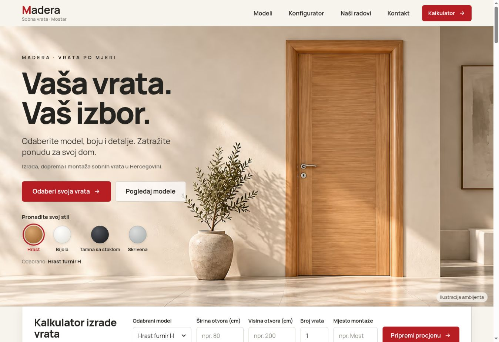

Slika, hrast, svjetlo i crveni poziv na akciju imaju smisla za Maderu. Naslov je čitljiv, vrata su cijela, a primarna akcija vidljiva. Ne bih odbacio ovaj pravac dizajna.

Slabosti:
- Prvi ekran je vrlo visok, a brzi kalkulator dolazi tek ispod hero slike.
- Hero prikazuje ilustraciju ambijenta, dok katalog odmah prelazi na neujednačene fotografije montaže. Taj prijelaz umanjuje dojam uređenog brenda.
- Nazivi „Odaberi svoja vrata”, „Kalkulator”, „Moj projekt”, „Moj izbor” i „Pripremi procjenu” ne objašnjavaju dovoljno jasno jedan glavni put do ponude.
- Prečice „Hrast/Bijela/Tamna/Skrivena” u kodu odabiru drugi zapis i vode u konfigurator. One ne mijenjaju samu hero fotografiju. To treba učiniti jasnim korisniku.

Preporuka: zadržati arhitektonski izgled, skratiti tekst i prvi ekran, koristiti jedan glavni naziv „Kreiraj svoj izbor” i drugi „Pogledaj modele”. Kratko pokazati „Mostar · Izrada i montaža u Hercegovini”.

## 2. Početna stranica na telefonu — loša hijerarhija, potvrđeno korisnikovom slikom

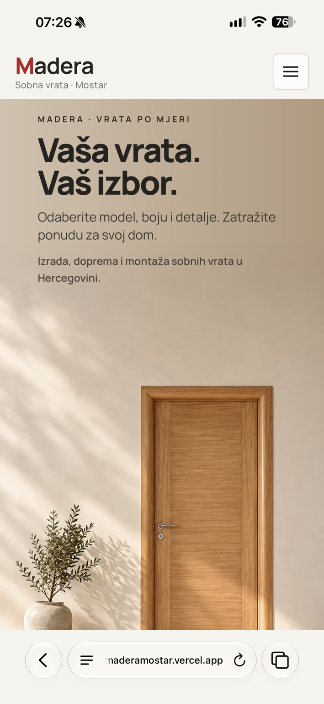

Na dostavljenoj slici vidi se naslov i puno zida. Vrata se pojavljuju nisko i ne stanu cijela u prikaz. Glavna akcija nije vidljiva u snimljenom prvom ekranu.

Kod objašnjava raspored: ispod 768 px tekst je zaseban blok, zatim dolazi cijela portretna slika omjera 1024/1536. Slika je visine oko 1,5 širine ekrana; tekst se dodaje iznad nje, uz negativni razmak od 64 px. Dugme je apsolutno postavljeno pri dnu cijelog hero bloka. To je duži sadržaj nego sam prvi ekran.

Popravka:
- Na 390 × 844 naslov, jedna kratka rečenica, jasno vidljiva vrata i glavno dugme moraju biti dostupni bez traženja akcije skrolanjem.
- Napraviti kompoziciju za mobilni ekran: tekst u gornjoj mirnoj zoni, vrata dovoljno velika da se prepoznaju, dugme neposredno ispod teksta ili pri dnu vidljivog hero prikaza.
- Smanjiti dodatni tekst u hero sekciji i premjestiti detalje usluge ispod nje.
- Koristiti stabilnu visinu prema dostupnom ekranu, s pravilima i za male visine; ne rastezati sav tekst i cijelu portretnu sliku jedan iza drugog.
- Provjeriti pri 320, 360, 390 i 430 px, uz povećan tekst i promjenjivu Safari traku.

Ovo je konkretna preporuka rasporeda. Novi mobilni izgled još nije napravljen niti testiran.

## 3. Katalog i modeli — funkcije rade, prezentacija traži uređenje

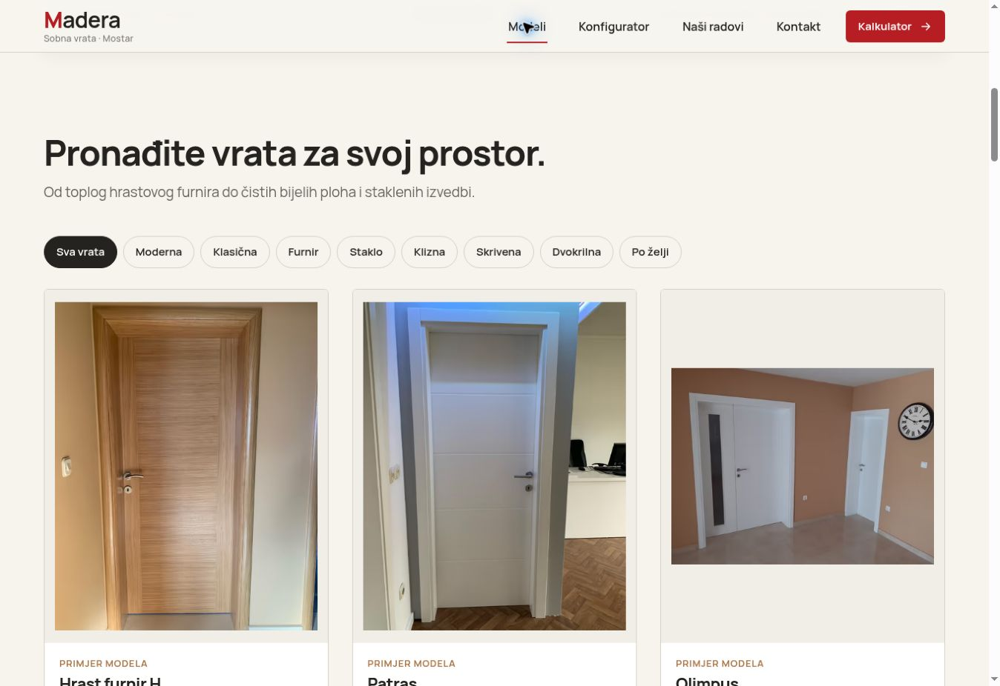

Provjereno:
- Početno se prikazuje 6 od 11 zapisa.
- Filter „Staklo” vraća 4 odgovarajuća zapisa.
- „Pogledaj sve izvedbe (11)” otvara svih 11.
- Detalji modela Patras se otvaraju; odabir prebacuje taj model u konfigurator.
- Naziv, fotografija i odabrani zapis usklađuju se pri izboru.

Vizuelni problem: fotografije imaju različit omjer, osvjetljenje i količinu okolnog prostora. Hrast i Patras zauzimaju gotovo cijeli okvir, dok je Olimpus mala ambijentalna fotografija s puno praznine. Jednake kartice zato ne izgledaju kao usporediv katalog proizvoda.

Prema početnom DOM mjerenju, sekcija kataloga zauzimala je oko 1812 px visine na desktopu. Na telefonu CSS prelazi na jednu kolonu, što dodatno produžava put do konfiguratora.

Preporuka:
- Odvojiti „Modeli vrata” od „Primjeri ugradnje”.
- Napraviti ujednačene produktne fotografije/render prikaze istih proporcija, uz stvarnu geometriju i detalje svakog modela.
- Do tada koristiti postojeće originale s poštenim kadriranjem i različitim pozicijama po slici; sačuvati cijelo krilo, štok i kvaku. Ne izmišljati drugi model iz fotografije.
- Smanjiti kartice i tekst; ime, kratka osobina, jasno dugme „Odaberi model”.
- Na telefonu omogućiti kompaktan pregled modela i jasno otkrivanje svih kategorija. Jedna velika kartica za svaka vrata daje previše skrolanja.
- Dostupnost i opcije potvrditi s Maderom. Objave iz ranije ponude same po sebi nisu današnji cjenovnik.

## 4. 3D — kritičan korisnički problem, uzrok Safari praznine nije konačno potvrđen

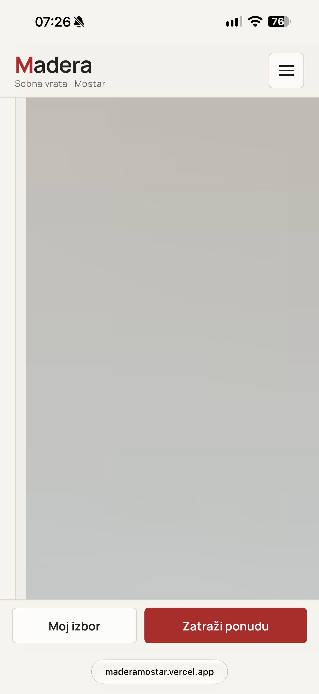

Na korisnikovoj slici veliki prostor ne prikazuje vrata ni jasnu poruku greške. Za posjetioca je to neupotrebljiva prezentacija.

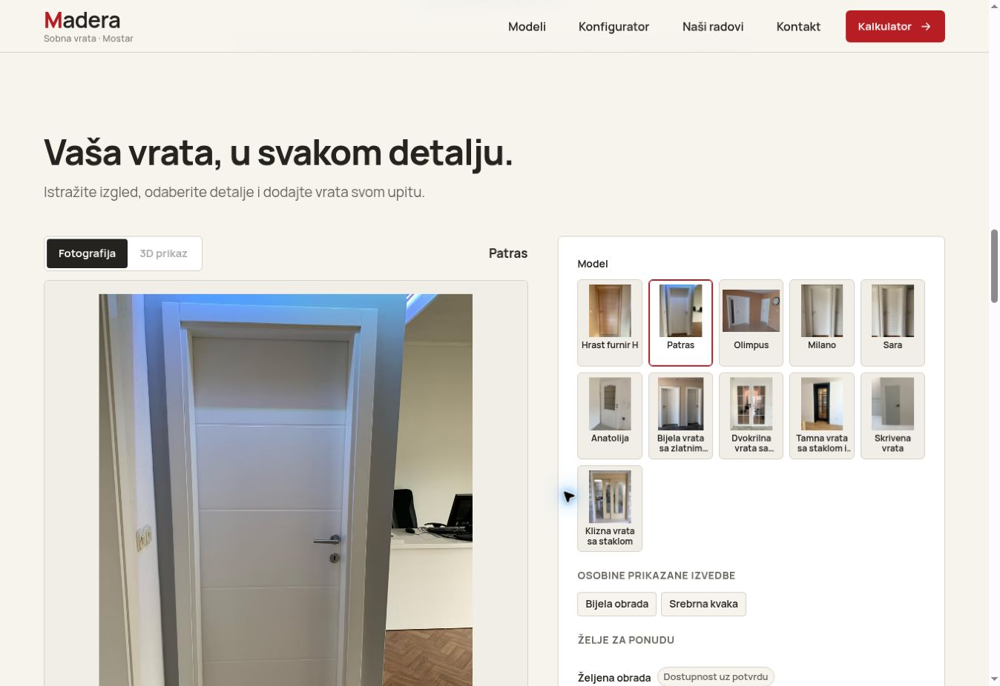

U mom pregledniku „3D prikaz” je isključen i prikazuje se stvarna fotografija. To je prihvatljiv zamjenski prikaz za okruženje bez WebGL-a. Samo isključeno dugme u ovom okruženju nije dokaz da 3D ne radi na svim uređajima.

Potvrđeno iz koda objavljene verzije:
1. `hasWebGL()` u `src/components/ViewerPanel.tsx` prihvata WebGL 2 **ili WebGL 1**. Projekt koristi Three.js 0.169.0, a službena dokumentacija navodi da WebGLRenderer od r163 zahtijeva WebGL 2. Detekcija sposobnosti je zato neusaglašena s rendererom. [T1]
2. `ReadySignal` u `src/three/DoorViewer.tsx` poziva `onReady` iz React efekta. To potvrđuje montiranje komponente, ne uspješno nacrtan kadar vrata. Fotografija može biti uklonjena prije potvrde stvarnog prikaza.
3. `ready` u ViewerPanelu ne vraća se na početno stanje pri ponovnom ulasku u 3D ili promjeni modela. Nakon ranijeg učitavanja zaštitna fotografija može izostati.
4. Postoji React ErrorBoundary, ali nema eksplicitnog rukovanja događajima `webglcontextlost`/`webglcontextrestored`, ni vremenskog ograničenja učitavanja ili jasnog ponovnog pokušaja.
5. Renderer koristi `demand` dok je vidljiv i `never` izvan prikaza. Štednja resursa ima smisla, ali povratak u vidljivo stanje mora pouzdano zatražiti prvi kadar. [T2]
6. Potvrđeni GLB modeli nisu dostavljeni: 3D je proceduralna ilustracija. Mjere u specifikacijama su demonstracijske, približno 80 × 200 cm za standardno jednokrilno krilo; unos širine otvora i visine ne mijenja te osnovne proporcije.

To su provjerene karakteristike koda. Nisu dokaz koji je tačno mehanizam izazvao korisnikovu Safari sliku.

Prioritet popravke:
- Fotografija ostaje dok postoji uspješno prikazan model.
- Jasna stanja: fotografija, učitavanje, spreman 3D, greška.
- WebGL 2 provjera; pokriveni renderer, resursi, izgubljeni kontekst i spor/neuspješan import.
- Nakon neuspjeha vratiti fotografiju i jednostavnu poruku „3D trenutno nije dostupan. Nastavite s odabirom na fotografiji.”
- Dugmad otvaranja i zooma dostupna tek kada renderer i API rade.
- Pri izboru drugog modela nova vrata počinju zatvorena; promjena boje/kvake mora ostati dosljedna.
- Posebno testirati ponovno vraćanje u aplikaciju iz pozadine i skrolanje izvan prikaza.

Kod već sadrži odvojene osi otvaranja, kvake vezane uz krilo, klizno otvaranje i provjere kolizija. To je korisna osnova. Vizuelnu ispravnost baglama, smjera i proporcija svih 11 modela ipak treba provjeriti u stvarnom rendereru uz fotografije; nije opravdano tvrditi da je to ovim auditom potvrđeno.

## 5. Konfigurator — radi kao obrazac, predugačak je

Odabir modela, crne kvake i smjera otvaranja ulazi u sažetak. Prazne mjere se odbijaju. Decimalni zarez „80,5” prihvata se. „Ne znam mjere” isključuje oba polja, a izbor ostaje moguć.

Početni desktop konfigurator zauzimao je oko 2230 px visine. Na desnoj strani odmah je mreža svih 11 minijatura, zatim osobine, obrade, kvake, otvaranje, mjere, sažetak i akcije. Na telefonu prikaz i sva ova polja idu jedan ispod drugog.

Predložena struktura:
1. **Model i izgled:** odabrani model, kratka traka drugih modela, boja i kvaka.
2. **Mjere i prostorija:** približne mjere otvora ili „Ne znam mjere”, količina i prostorija.
3. **Pregled i kontakt:** slika izbora, specifikacija i sljedeća akcija.

Desktop: veliki prikaz lijevo, kompaktan panel trenutnog koraka desno. Telefon: prikaz približno 280–360 px visine kao polazna dizajnerska mjera, zatim kontrole jednog koraka. Ne pretvoriti cijelu stranicu u više unutrašnjih skrolajućih okvira.

Smjer otvaranja objasniti malim pogledom odozgo sa zidom, baglamama, kvakom i lukom otvaranja. Tekst „kvaka lijevo/desno” sam po sebi teško objašnjava položaj. „Nisam siguran/na” treba ostati mogućnost.

## 6. Kalkulator — nema cijene i može zbuniti izborom projekta

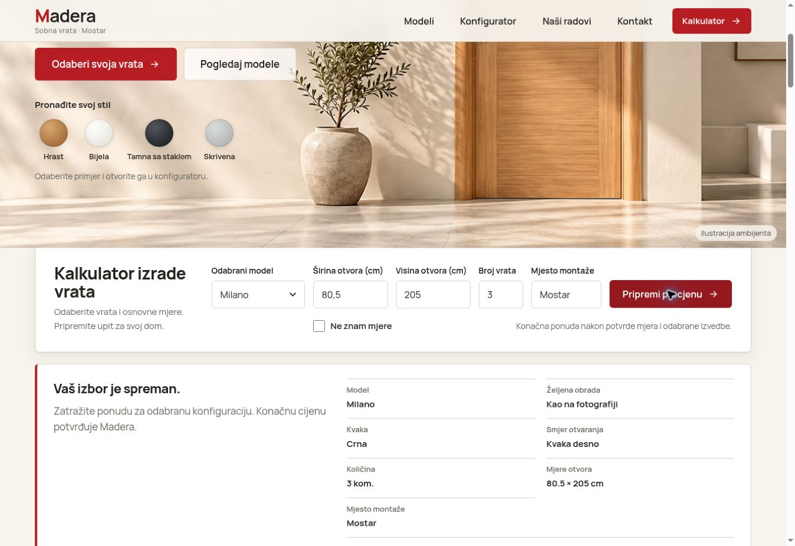

Kalkulator prihvata valjan unos, odbija količinu nula i prikazuje sažetak. Međutim, ne prikazuje iznos. Postavke imaju neodobren cjenovnik i režim upita za ponudu. To je pošteno; cijene ne treba izmišljati. Naziv „Kalkulator” i „Pripremi procjenu” ipak stvaraju očekivanje izračuna.

Posebno provjerena situacija:
1. U projektu su Milano, 3 komada.
2. U kalkulatoru se odabere Sara, 1 komad.
3. Rezultat prikazuje trenutnu Saru i postojeće prostorije projekta.
4. „Nastavi na upit” otvara Milano, 3 komada; Sara nije uključena.
5. Upozorenje o nedodanom trenutnom izboru postoji, ali je ispod akcija.

To je namjerna logika u kodu, ali slab korisnički tok. Ispraviti jasnim izborom „Ponuda za ova vrata” i „Ponuda za cijeli projekt (3 vrata)”, bez implicitnog mijenjanja obuhvata.

Bolja ideja za sada: istaknuti **Planer vrata za cijeli dom**, s oznakom „Cijena na upit”, mini izborom modela, količine i mjesta. Pravi kalkulator aktivirati kada Madera unese odobrene cijene, doplate, montažu, dopremu i način poreznog prikaza. Nepoznat trošak ne smije postati 0 KM.

## 7. Projekt — uglavnom zdrav dio stranice

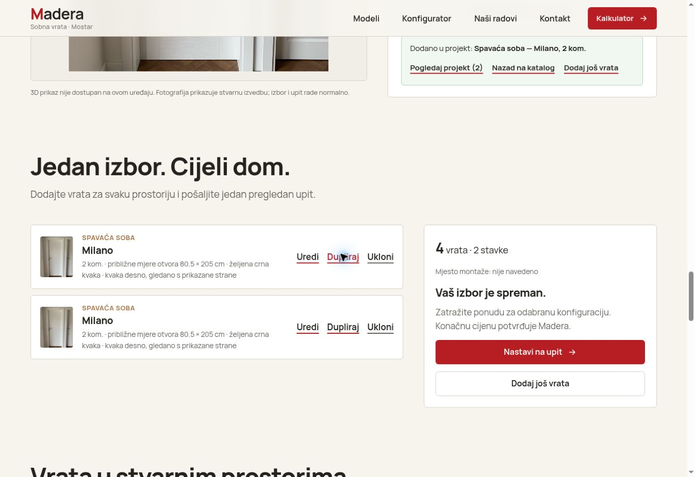

U ovom testu prošli su:
- Dodavanje stavke s mjerama 80,5 × 205 cm.
- Dupliranje: dvije stavke po 2 komada daju ukupno 4 vrata.
- Uklanjanje kopije.
- Uređivanje količine sa 2 na 3.
- Zadržavanje projekta poslije osvježavanja stranice.

Predložiti jedan naziv „Moj izbor” u svim dijelovima. Omogućiti jednostavno preimenovanje prostorije, dodavanje naredne stavke i jasan broj vrata. Opcija „Dupliraj” ima stvarnu vrijednost kada više soba koristi isti model.

## 8. Upit — priprema radi, direktno slanje nije povezano

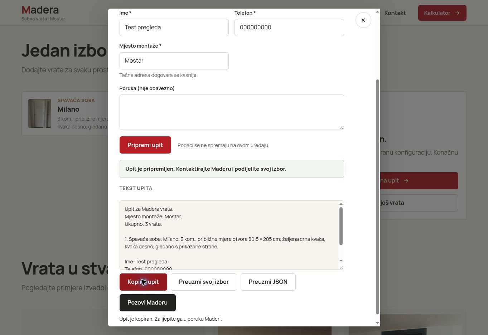

Provjereni su obavezno ime/telefon, priprema probnog teksta, kopiranje i TXT preuzimanje. Preuzeti tekst sadrži model, količinu, mjere, mjesto i podatke iz probnog obrasca.

Odredište kontaktne forme i e-mail u postavkama su `null`; WhatsApp je isključen. Korisnik nakon popunjavanja mora kopirati tekst i poslati ga drugim kanalom ili nazvati. Upit nije dostavljen Maderi u ovom toku. „Preuzmi JSON” je tehnički sadržaj i nepotrebno opterećuje kupca.

Pravi prodajni završetak treba biti:
- slanje na potvrđeni poslovni kanal,
- slika i kompletna specifikacija projekta,
- uspjeh tek nakon odgovora servera,
- sačuvan izbor i mogućnost ponovnog pokušaja pri grešci.

Dok kanal nije poznat, izričito pisati „Upit je pripremljen, još nije poslan”. Ne prikazivati uspjeh dostave bez stvarne dostave. WhatsApp uvesti samo ako je potvrđen za taj poslovni broj.

## 9. Galerija, FAQ i kontakt — pregledane osnovne funkcije rade

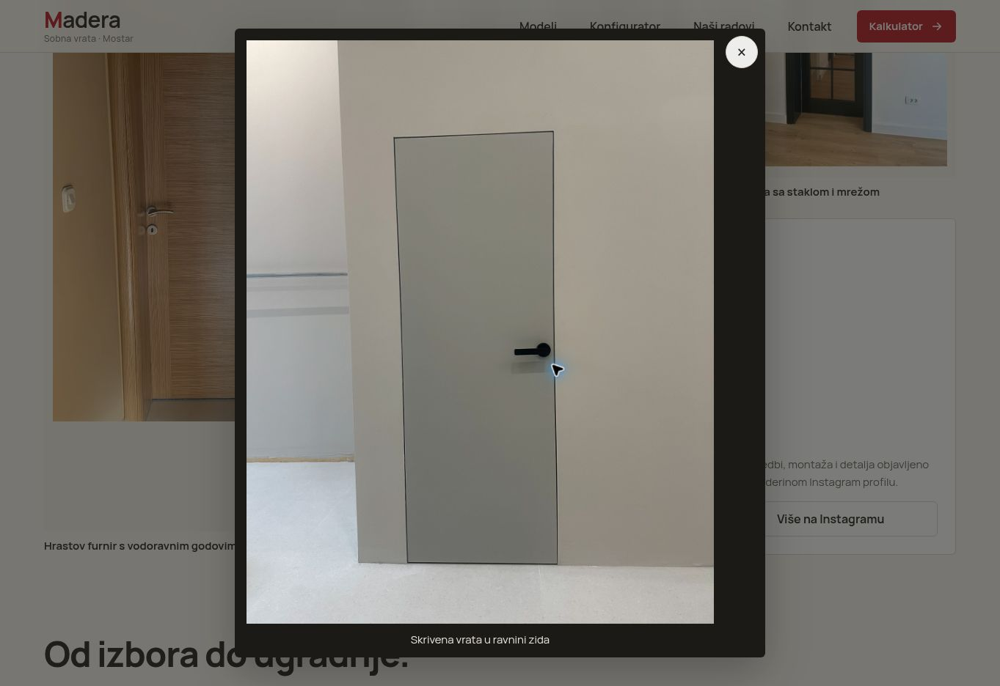

Galerija otvara i zatvara veću fotografiju. Odgovor „Nemam tačne mjere” se otvara i daje korisnu informaciju. Telefon i Instagram imaju odgovarajuće odredišne linkove; poziv ili poruka nisu slani.

Vizuelno su stvarne ugradnje bolji dokaz kvaliteta od brojnih dekorativnih animacija. Dodati kratke opise projekta, materijal i relevantan detalj, kad su potvrđeni. Ne izmišljati recenzije, garancije, rokove ili broj izvedenih projekata.

## 10. Međunarodni uzori — šta primijeniti i šta je potvrđeno

Ovo je odabir relevantnih uzora, ne objektivna svjetska rang-lista. Razlikujem proizvodni 3D konfigurator, arhitektonsku prezentaciju i 360° obilazak prostora.

| Uzor | Relevantna praksa | Primjena na Maderu | Granica provjere |
|---|---|---|---|
| TruStile, SAD [R1] | Ujednačen katalog; pretraga serije/modela; službeno opisani real-time izbor, slika, specifikacija i GLB izvoz | Jednake proporcije prikaza; vizuelni izbor prije tehničkih detalja; pregled projekta sa slikom | Katalog i pretraga pregledani uživo. 3D nije uspješno prikazan u ovom WebGL okruženju |
| Aurea / DirectPortes, Evropa [R2] | WebGL konfiguracija sobnih vrata, tip otvaranja, boja, okvir, kvaka i tehnički detalji | Različita geometrija po stvarnom modelu, kompatibilne opcije i detalji | Službena studija izvođača; nije izvršen kompletan live tok DirectPortesa |
| heroal / redPlant, Njemačka [R3] | PBR materijali, različiti ambijenti, ID konfiguracije, podatkovni list i povezan upit | Kvalitet površine, pogled iz prostorije, konfiguracija koja prelazi direktno u ponudu | Ulazna vrata, srodna branša. Live pregled u ovom okruženju završio je na „nowebgl” stranici |
| Ermetika, Italija [R4] | Vidljivi koraci za tip, poznate dimenzije, zid i mjere | Postepeno otkrivanje polja umjesto ogromnog obrasca | Službena stranica i početni ekran; naknadni pregled je vremenski istekao |
| Lualdi, Italija [R5] | Arhitektonske fotografije i kategorije po tipu, materijalu i otvaranju | Mirniji katalog, vrata u ambijentu i pažnja na stvarne materijale | Katalog vizuelno pregledan; nije testiran virtualni obilazak |
| OPPEIN UAE, Dubai [R6] | Jasna akcija za ponudu, primjeri enterijera i kratak put do kontakta | Vidljiva ponuda iznad pregiba i relevantni primjeri ugradnje | Stranica vrata pregledana. „Free 3D design” je usluga; nije dokaz interaktivnog web konfiguratora |

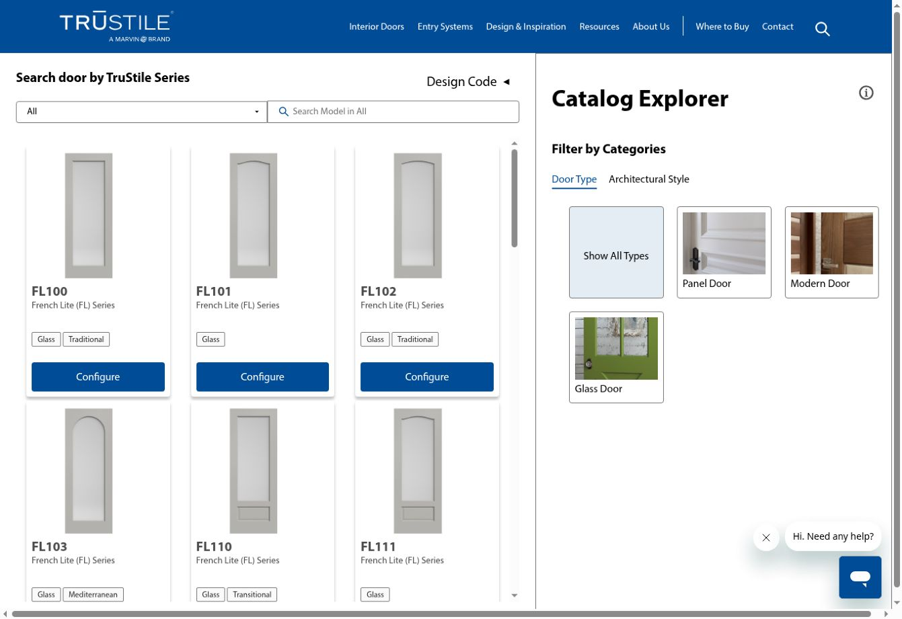

TruStile omogućava lakšu usporedbu silueta i modela. Njegov živi prikaz u ovom pregledniku ima i horizontalnu traku, a 3D se nije učitao. Preuzeti korisne obrasce, ne kopirati cijelu izvedbu kao nepogrešiv standard.

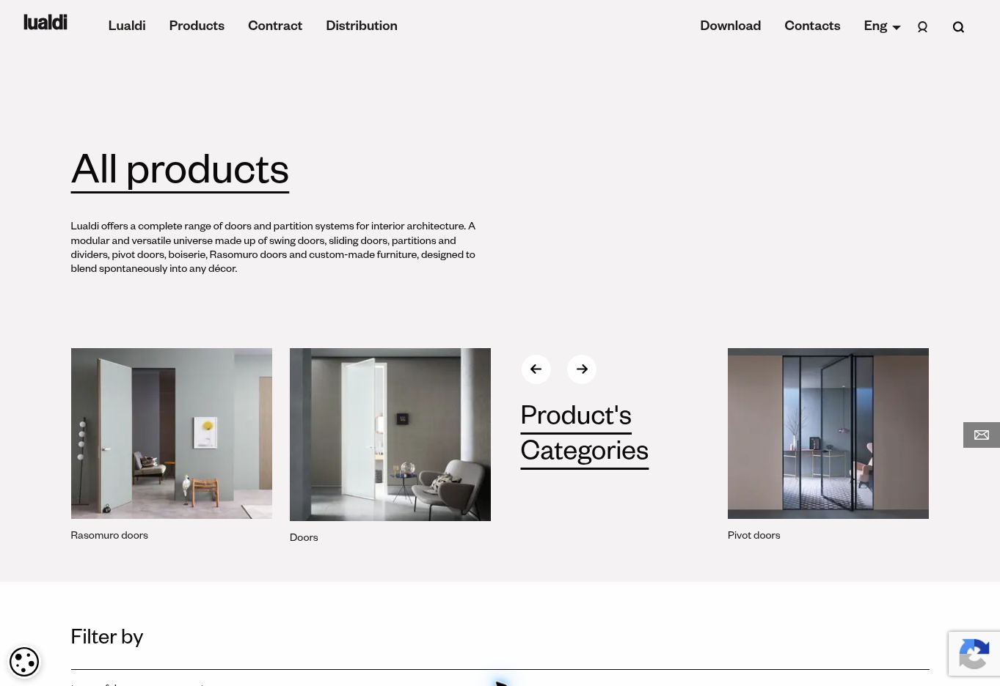

Lualdi je vizuelni uzor za miran raspored i vrata u kvalitetnom ambijentu. To je moja dizajnerska procjena na osnovu prikaza.

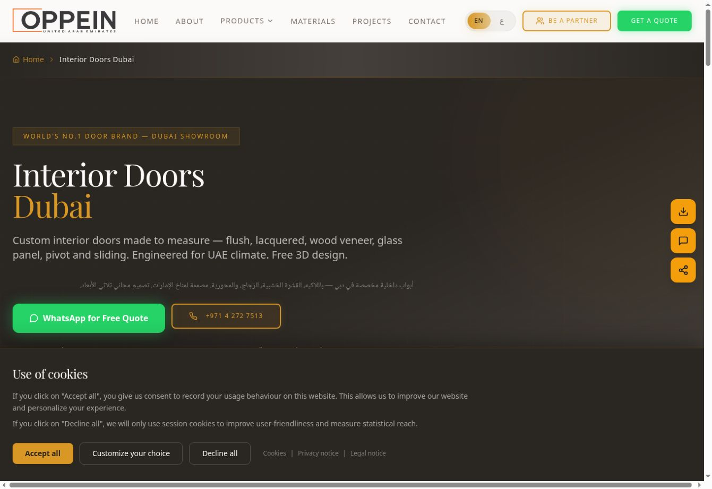

OPPEIN ovdje koristi direktnu akciju za ponudu. Ne bih preuzimao veliki broj plutajućih dugmadi, tvrdnje o vodećoj poziciji ili njihov kompletan tamni stil. Maderin odabrani svijetli pravac bolje odgovara postojećem identitetu.

## 11. Redoslijed popravke

| Prioritet | Konkretan posao | Dokaz završetka |
|---|---|---|
| P0 | Viewer nikad ne ostaje prazan; ispravna WebGL 2 detekcija, prvi kadar, greška i gubitak konteksta | Snimke fotografije, rada 3D-a i namjerne greške na desktopu i telefonu |
| P0 | Vidljiva mobilna glavna akcija i prepoznatljiva vrata | Početni ekran 390 × 844 i mali ekran 320 px |
| P0 za stvarno prikupljanje upita | Potvrđeni kanal za dostavu ili pošteno označena priprema bez slanja | Test primljenog upita; bez kanala ne tvrditi da je slanje završeno |
| P1 | Razlikovati trenutna vrata od cijelog projekta u kalkulatoru i upitu | Scenario Sara 1 / Milano 3 daje tačno odabrani obuhvat |
| P1 | Tri koraka konfiguratora i kompaktne kontrole | Funkcionalan tok uz vidljiv model i akciju |
| P1 | Ujednačen katalog i precizna veza slike i modela | Usporedni pregled svih 11 zapisa |
| P2 | Kvalitetniji stvarni 3D modeli, materijali, detalji i ambijenti | Vizuelna provjera uz originalne proizvode |
| P2 | PDF/sažetak sa slikom, poboljšana galerija i naknadne performance provjere | Izvoz i mjerenja na završnoj implementaciji |

Najbolje sljedeće ulaganje je pouzdan i kratak tok: **vidim vrata → izaberem izgled → dodam prostorije → zatražim ponudu**. Veliki 3D obilazak cijelog salona može doći kasnije, kada postoje stvarno snimljeni prostori. Za sada bi povećao trošak i složenost bez rješavanja glavnih problema.

## Izvori

[R1] TruStile: https://www.trustile.com/door-visualizer ; živi katalog: https://www.trustile.com/visualizer

[R2] Aurea, DirectPortes studija: https://aurealab.net/configuratore-3d-porte-interne/?lang=en

[R3] redPlant, heroal studija: https://redplant.net/work-projects-interactive-3d/webgl-3d-configurator-front-door-configurator/

[R4] Ermetika: https://www.ermetika.com/en/configurator

[R5] Lualdi: https://www.lualdiporte.com/en/products/

[R6] OPPEIN Dubai: https://www.oppein.ae/interior-doors-dubai

[T1] Three.js WebGLRenderer: https://threejs.org/docs/pages/WebGLRenderer.html

[T2] R3F Canvas i performance: https://r3f.docs.pmnd.rs/api/canvas ; https://r3f.docs.pmnd.rs/advanced/scaling-performance

Izvorni projekt: https://github.com/tvkuca1113-art/Maderamostar
Objavljena verzija pregledanog koda: `5944e08afd706c724cf29d7fac1c40d596a0efc2`.

## Paket

Uz izvještaj dolazi poseban prompt za Claude Code. Snimke sa prefiksom „iphone” su korisnikovi dokazi; ostale su nastale tokom ovog pregleda. Nema novih generiranih slika ni novih CAD/GLB modela u ovom paketu.

